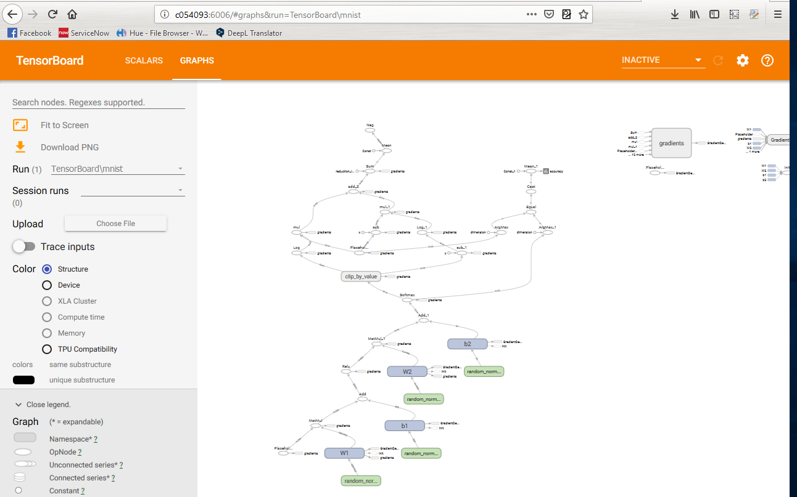

# Develop DL models using Tensorflow and pipelines for industrialization and model serving

# TensorFlow and Google Cloud Platform (GCP) documentation and instruction
- TensorFlow notes
  [Notes](doc/notes_h.md)
- Google Cloud Platform Fundamentals
  [Lectures](doc/notes_gcp/gcp_fundamentals_lectures.md)
- Google Cloud Platform Instruction
  - Google Cloud Datalab
    [Instructions](doc/notes_gc/gcp_datalab.md)
  
# General presentation and results of this project:
[Documentation](doc/DOC.md)


# Check if your Anaconda/python installation is configured "properly"
[Configuration](doc/SETUP.md)

# How to install the code

## Download the code from GitHub
- go to the directory in which you want to download the package from git  
- download the package from Github:   
  - ```git clone https://github.com/tarrade/proj_DL_models_and_pipelines_with_GCP.git```
  - or with other method from your choice (web interface, zip ...)   
- open an "Anaconda prompt" in the directory that contain the code from GitHub:   
  ```your_dir/proj_DL_models_and_pipelines_with_GCP/```

## Create the python conda env  
This will provide you a unique list of python packages needed to run the code.
It seems 1.12 is causing trouble on  a Mac, use 1.11 instead

- create a python env based on a list of packages from environment.yml    
  ```conda env create -f environment.yml -n env_gcp_dl```
  
 - activate the env  
  ```conda activate env_gcp_dl```
  
 - in case of issue clean all the cache in conda
   ```conda clean -a -y```

## Update or delete the python conda env 
- update a python env based on a list of packages from environment.yml  
  ```conda env update -f environment.yml -n env_gcp_dl```

- delete the env to recreate it when too many changes are done  
  ```conda env remove -n env_gcp_dl```

## TensorBoard
- open a anaconda prompt
- go to the directory in which you want to download the package from git  
- activate the env:   
  ```conda activate env_gcp_dl```
- execute TensorBoard:   
  ```tensorboard --logdir ./results```
- open a web browser (Firefox) and copy the link that appear in the prompt above:    
  ```http://<something>:6006```
 
  
   
 